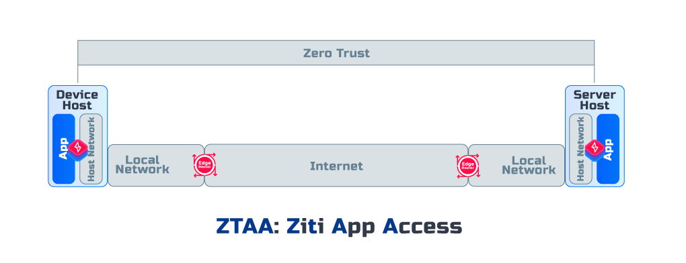

<a href="https://docs.openziti.io/">
    
</a>

# Python SDK for OpenZiti
:star: Star OpenZiti on GitHub [](https://github.com/openziti/ziti/stargazers)
<p align="center">
  <a href="https://openziti.discourse.group/">
    
  </a>
  <a href="https://pypi.org/project/openziti/">
    
  </a>
  <a href="https://opensource.org/licenses/Apache-2.0">
    
  </a>
</p>

<p align="center">
  <a href="#getting-started">Getting Started</a> •
  <a href="#examples">Examples</a> •
  <a href="#support">Support</a> •
  <a href="#contributing">Contributing</a> •
  <a href="#license">License</a>
</p>


The Python SDK for OpenZiti is a library that enables you to integrate zero trust network connectivity into your Python 
applications, and establish secure connections with remote network resources over an OpenZiti network. The SDK also 
simplifies the process of adding secure, zero-trust network connectivity built into your Python application. It's so 
simple that it can be done in just two lines of code.

OpenZiti is an open-source project that provides secure, zero-trust networking for applications running on any platform.

More specifically, the SDK allows you to integrate zero trust at the application level. This means your data is never 
exposed outside the application environment providing you with end-to-end encryption for ultimate security.
<p align="center">

</p>

## Getting Started
If you don't already have an OpenZiti network running, you can follow our [express install guides](https://docs.openziti.io/docs/learn/quickstarts/network/) 
to set up the network that fits your needs. Or, you can try cloud Ziti for free, check out more [here](https://docs.openziti.io/).

### Installing the SDK

The Python SDK for OpenZiti is distributed via the Python Package Index (PyPI) and can be installed using 
[`pip`](https://pypi.org/project/openziti/) package manager.

```shell
pip install openziti
```

### Using Ziti Python SDK
With just two lines of code, you can turn your plain old web server into a secure, zero-trust embedded application. 
Below is an example of just how simple it is to get started.

Provide a hostname, and port for your application, a simple monkeypatch, and you're ready to go. You don't even need to 
know what a monkeypatch is!
```python
cfg = dict(ztx=openziti.load('/path/to/identity.json'), service="name-of-ziti-service")
openziti.monkeypatch(bindings={('127.0.0.1', 8000): cfg})
```
Or try our decorator pattern with a function annotation
```python
@openziti.zitify(bindings={('127.0.0.1', 18080): {'ztx': '/path/to/identity.json', 'service': 'name-of-ziti-service'}})
def yourFunction():
```
## Examples
Try it out yourself with one of our [examples](sample%2FREADME.md)
* [Flazk](sample/flask-of-ziti)
* [HZTP](sample/h-ziti-p)
* [HTTP GET](sample/http-get)
* [Echo Server](sample/ziti-echo-server)
* [HTTP Server](sample/ziti-http-server)
* [Ziti Socket](sample/ziti-socket-example)

## Support
### Looking for Help?
Please use these community resources for getting help. We use GitHub [issues](https://github.com/openziti/ziti-sdk-py/issues)
for tracking bugs and feature requests and have limited bandwidth to address them.

- Read the [offical docs](https://docs.openziti.io/docs/learn/introduction/)
- Join our [Developer Community](https://openziti.org)
- Participate in discussion on [Discourse](https://openziti.discourse.group/)
## Contributing
Do you want to get your hands dirty and help make OpenZiti better? Contribute to the OpenZiti open-source project 
through bug reports, bug fixes, documentation, etc. Check out our guide on contributing to our projects [here](https://docs.openziti.io/policies/CONTRIBUTING.html).
## License
[Apache 2.0](./LICENSE)
